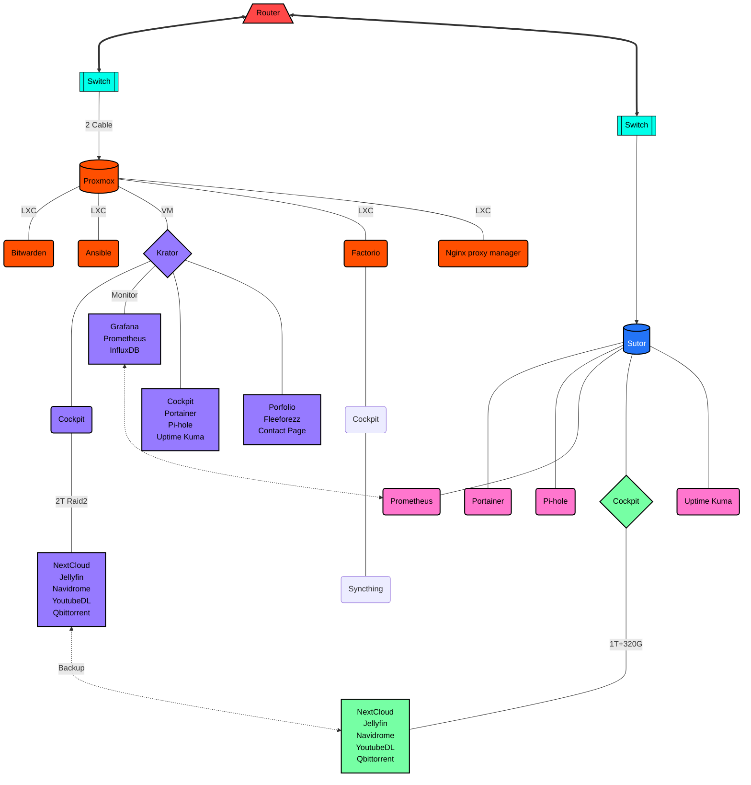

<!--Header-->
<header>

</header>

<!--Greeting-->
<h1 align="center">
    Yo!👋 I'm Nhat, I love <b>Building</b> and <b>Making</b> things colorful 🎨
</h1>

<!--Contact-->
<h3 align="center">
    How to contact me 🤔
      
    
    
    
</h3>

<!--Stat & Spotify dash-->
<table width="100%">
 <tr>
   <td width="50%">

&nbsp;   

   </td>
   <td width="50%">

&nbsp;   

   </td>
 </tr>
</table>

<!--Skills-->
<h1> 
    Tools i used to develop 💪 
</h1>

<table width="100%">
    <tr>
        <td align="center" width="15%">
            
              HTML
        </td>
        <td align="center" width="15%">
            
              CSS
        </td>
        <td align="center" width="15%">
            
              JavaScript
        </td>
        <td align="center" width="15%">
            
              Linux
        </td>
        <td align="center" width="15%">
            
              Git
        </td>
    </tr>
    <tr width="100%">
        <td algin="center" width="15%">
            
              Docker
        </td>
        <td algin="center" width="15%">
            
              Kubernetes
        </td>
        <td algin="center" width="15%">
            
              Nginx
        </td>
        <td algin="center" width="15%">
            
              Java
        </td>
        <td algin="center" width="15%">
            
              MySQL
        </td>
    </tr>
</table>

<!-- Favorite project -->
<h1>
    Take a look at my favorite projects
</h1>

<table width="100%">
 <tr>
   <td width="50%">

&nbsp;   

   </td>
   <td width="50%">

&nbsp;   

   </td>
 </tr>
</table>

